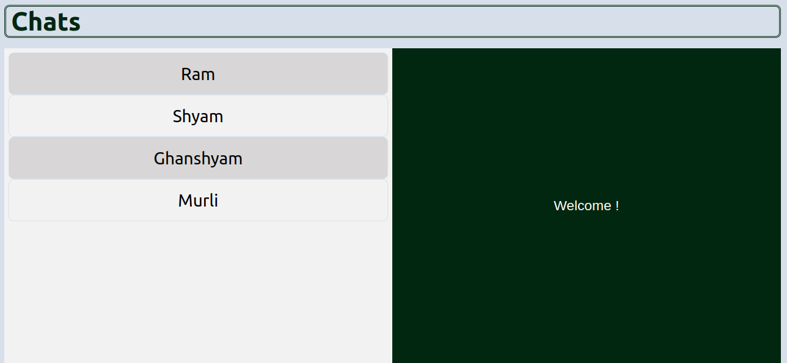
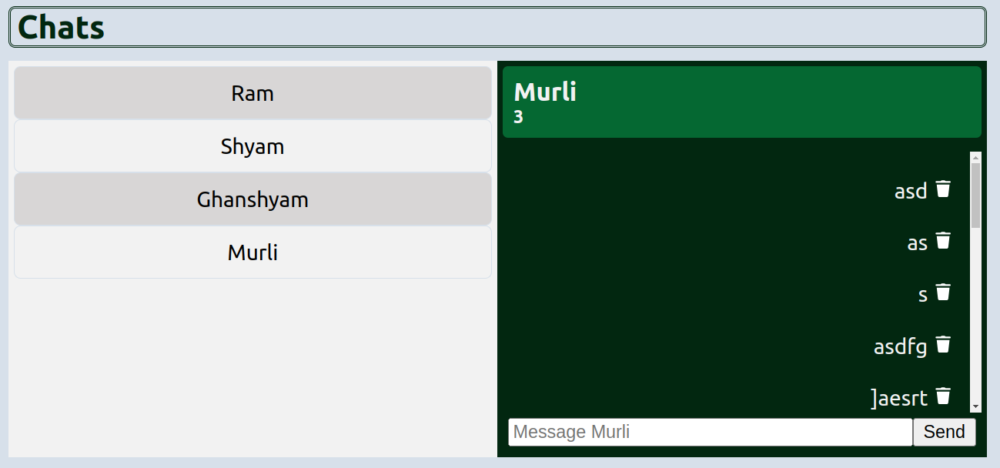

## UI/UX

The design is kept generic for the better user experience. The user land on the homepage and once user clicks on any contact from the contact list given on the left panel, chat window appears for that contact like other popular web messaging applications. The choice of colors and appearance reflects the combination of light and dark mode. 
Bit and pieces of design are inspired from various web messaging application like Web WhatsApp, Slack etc.

1. HomePage - It is the first page for the application 
    
    

1. ChatWindow - When user clicks on one of the contact, a chat window of that contact is open up on right panel. On the chat window user can see contact details, message history and can send new message. Additionally user can also delete old messages.
    
    